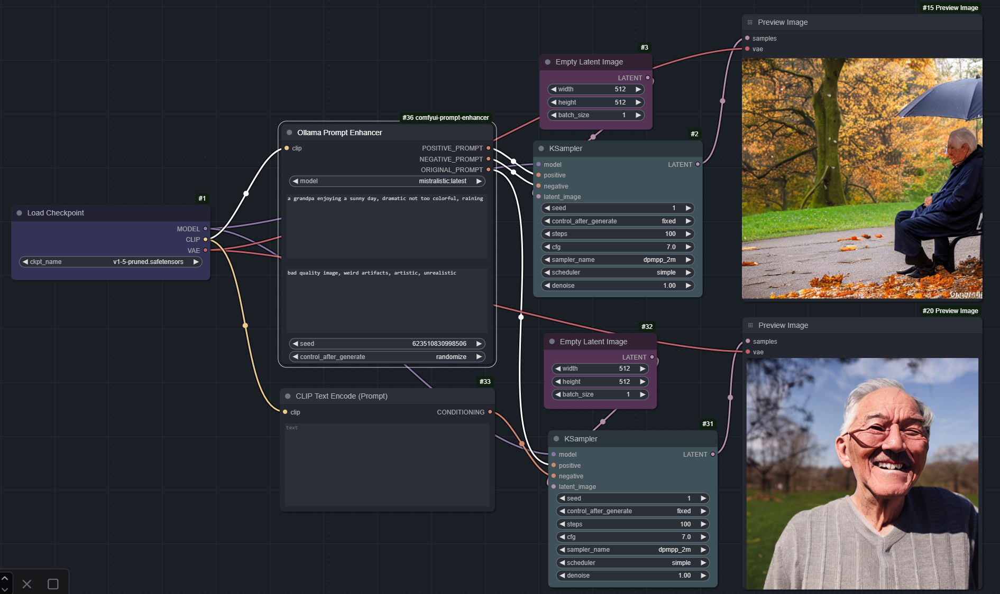

## Ollama Prompt Enhancer

A crazy nodes that pragmatically just enhances experience on prompting with various descriptions in the hope that the image quality just increases and prompting gets easier.

## Nodes Available

**PROMPT_ENHANCER:** 
Basic prompt enhancing based on a sentence that contains SD15 preferred prompting style. 
See code for prompt to LLM.

**PROMPT_ENHANCER_CHAIN_RANDOM & PROMPT_ENHANCER_CHAIN_CONTROL:** 
Make a chain of dynamic LLM prompting using various categories

**PROMPT_ENHANCER_REPROMPT:** 
Use multiple prompts in a multiline textedit separated per newline (`\n`) using ComfyUI's "Queue (Instant)" to generate images per prompt line 
until list of prompts exhausted and exception occurs to tell the user to change the multiline prompt. (For now until better idea)

## Hints
This node requires an N-th amount of VRAM based on loaded LLM on top of stable diffusion or flux.  
Since ollama keeps a given model loaded via ``olama run <model>`` as long the instance is running.

So for example using SD1.5 ~ 5GB VRAM + Mistral:3B uses around 16 GB VRAM (this is just predicted on my system under windows).
  Have to be careful when loading too many models since it overloads the vram and you must probably quit ollama and restart the instance.  
**Ollama must be running or else the node will not be found / visible when starting comfyui.**

## Installation
You need to have ollama installed from https://ollama.com before continue. 
When within your custom python environment go to the `custom_nodes/comfyui-prompt-enhancer` folder and install via `pip install -r requirements requirements.txt`.  If you feeling lucky you can also install via `pip install ollama`
That should be it.

## Example

